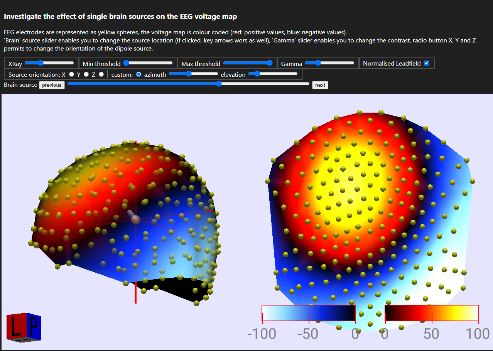
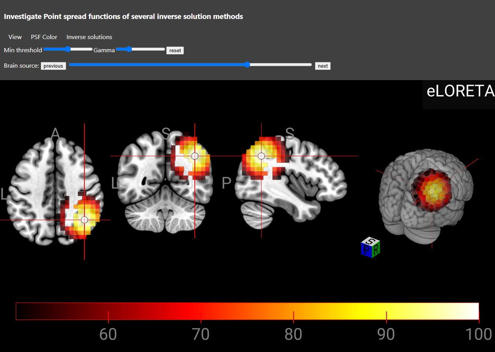
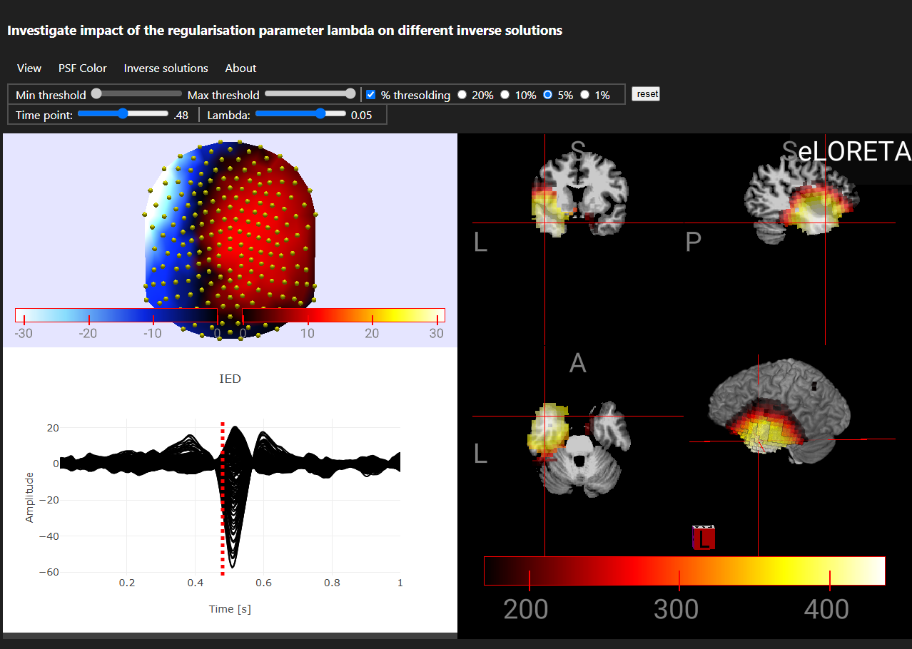
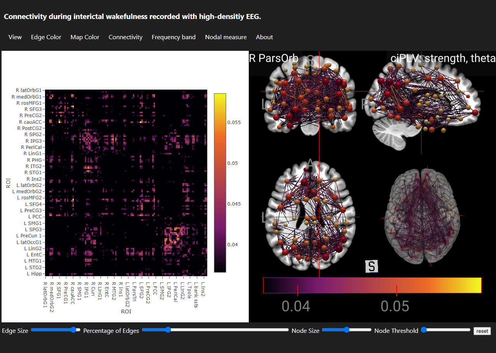
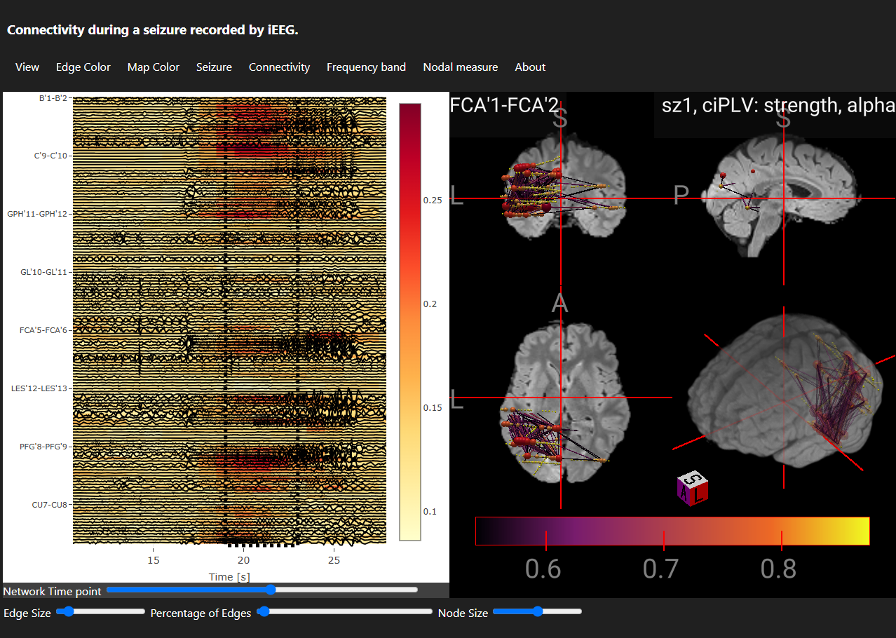

## Description

Collections of interactive web applications for the visualisation, teaching and investigation of advanced scalp EEG and intracranial EEG analysis.

## Some examples

### Leadfield Visualisation
  

### ESI Spatial Leakage
  

### EEG Epileptiform Discharge Localisation
 
 
### Generalized Epilepsy Connectivity from high-density EEG
  

### Seizure Network Dynamics from intracranial EEG
  

