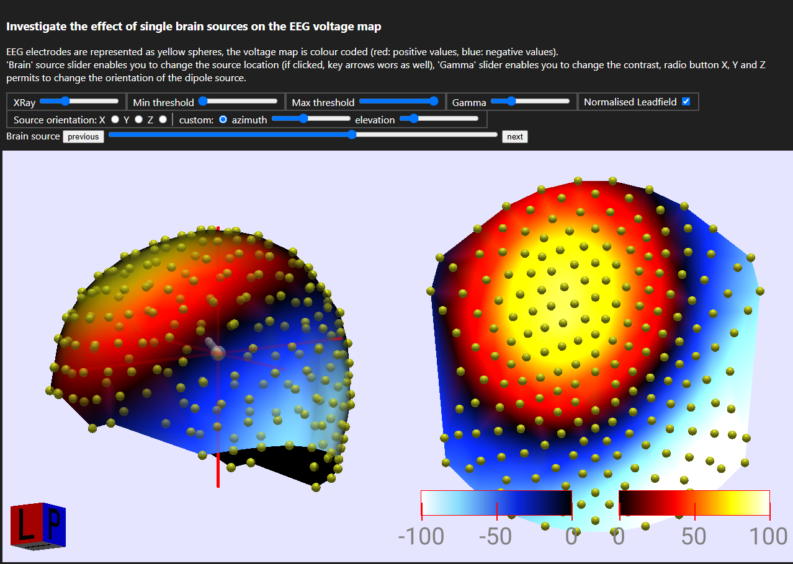
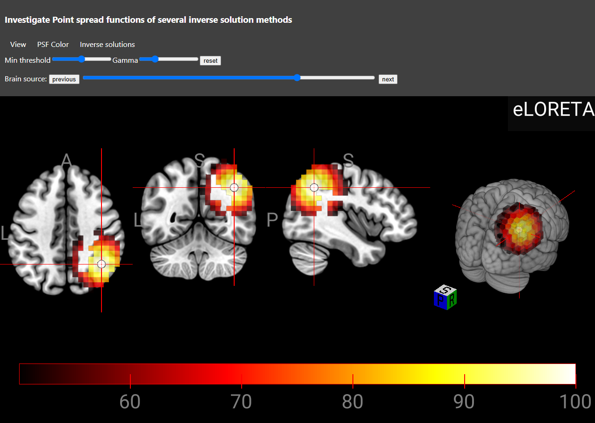
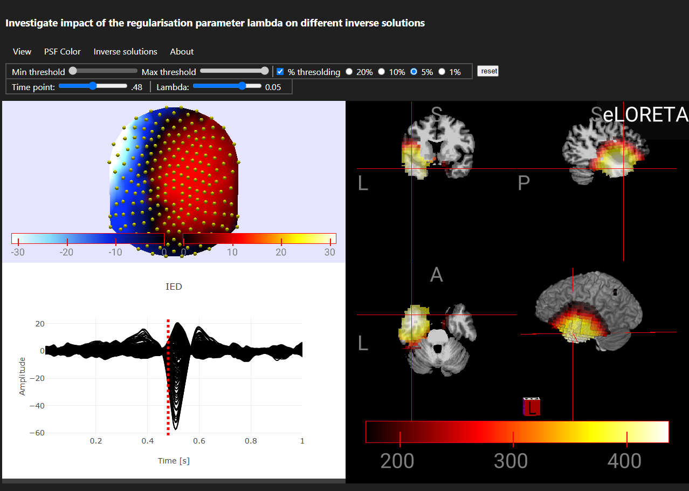
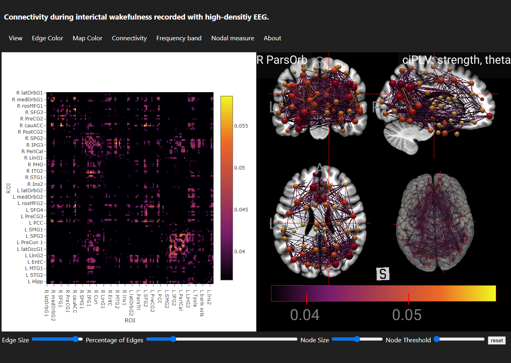
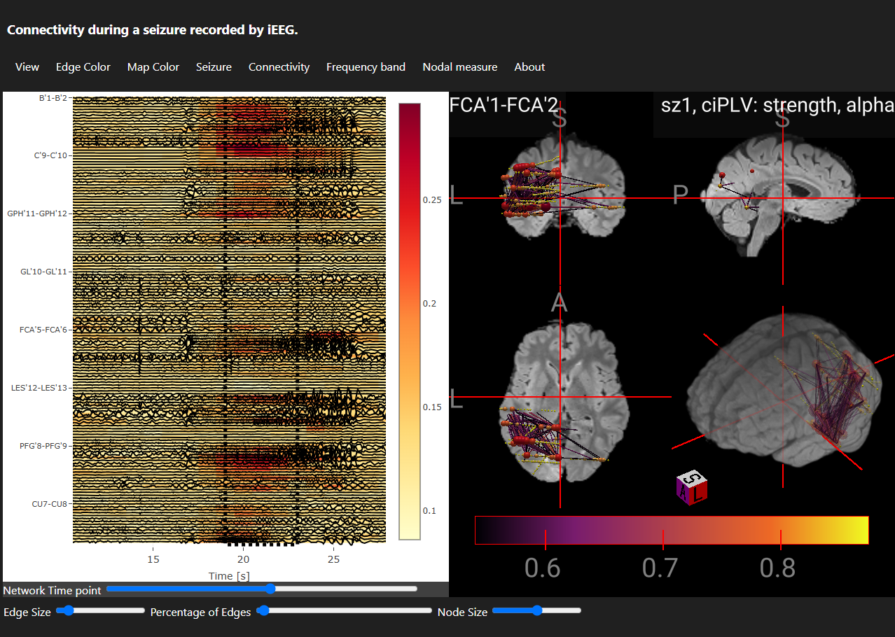
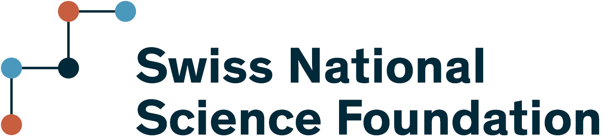
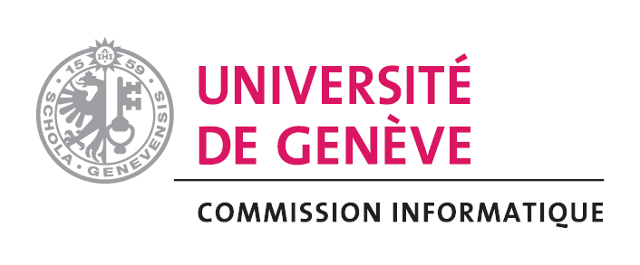

## Description

Collections of interactive web applications for the visualisation, teaching and investigation of advanced scalp EEG and intracranial EEG analysis.

## GitHub Page

### [https://roehrin.github.io/webapps_for_EEG_courses](https://roehrin.github.io/webapps_for_EEG_courses)

## Some examples

### [Leadfield Visualisation](https://roehrin.github.io/webapps_for_EEG_courses/examples/EEG_mesh_with_topo.html)

  

### [ESI Spatial Leakage](https://roehrin.github.io/webapps_for_EEG_courses/examples/display_Point_Spread_Functions_on_MRI.html)
  

### [EEG Epileptiform Discharge Localisation](https://roehrin.github.io/webapps_for_EEG_courses/examples/IED_localisation_and_regularisation.html)
 
 
### [Generalized Epilepsy Connectivity from high-density EEG](https://roehrin.github.io/webapps_for_EEG_courses/examples/non_invasive_interictal_connectivity.html)
  

### [Seizure Network Dynamics from intracranial EEG](https://roehrin.github.io/webapps_for_EEG_courses/examples/ictal_connectivity.html)
  

## Running in local environment (Python version)
1. Open the terminal at the project root folder
2. enter `python3 -m http.server 8080`
3. go to `http://localhost:8080`

## Project funding
This project was funded by the Swiss National Science Foundation (209120 to Dr Roehri, 209470 to Dr Vulliemoz) and la commission d'informatique of the UNIGE  

## Contributors
- Dr. Nicolas Roehri
- Steven Beumer MSc
- Dr. Isotta Rigoni
- Dr. Stanislas Lagarde
- Dr. Serge Vulliemoz
